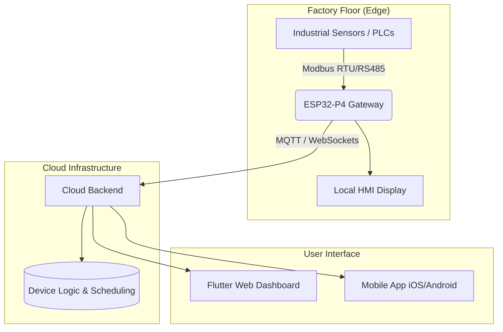

---

# 🏭 Herin Industrial IoT Platform
### *Real-Time PLC Automation & Legacy Machine Modernization*

The **Herin Industrial IoT Platform** is an enterprise-grade ecosystem designed to bridge the gap between traditional industrial machinery and modern cloud-controlled automation. By converting legacy RS485/Modbus-based PLC systems into a real-time, deterministic network, Herin enables factories to achieve Industry 4.0 standards without replacing existing hardware.

[**🌐 Live Dashboard**](https://heiot.herin.in) • [**🤖 Android App**](https://play.google.com/store/apps/details?id=ccom.herin.iot) • [**🍎 iOS App**](https://apps.apple.com/in/app/herin-iot/id6642696241)

---

## 🚀 Project Overview

Unlike hobbyist IoT projects, this platform is engineered for **Industrial Reliability**. It provides a complete vertical stack—from custom PCB hardware and ESP-IDF firmware to a scalable cloud backend and cross-platform Flutter applications.

**Current Status:** Successfully deployed and operational in **3 Multinational Manufacturing Companies**.

### Core Capabilities:
*   **Live Monitoring:** Real-time telemetry from factory floor to global HQ.
*   **Remote Control:** Authorized bi-directional control of PLC registers.
*   **Scheduled Automation:** Cloud-driven batch processing and time-based triggering.
*   **PID Regulation:** Closed-loop thermal and mechanical control at the edge.
*   **Cross-Platform UI:** Seamless operator experience on Web, Android, iOS, and local HMI.

---

## 🏗 System Architecture

---

## ⚙️ Engineering Stack

### 1. The Gateway (ESP32-P4 Industrial)
At the heart of the system is the **ESP32-P4 (High-performance RISC-V)**. 
*   **Connectivity:** Native 10/100 Mbps Ethernet for high-noise industrial environments (replaces unstable Wi-Fi).
*   **Performance:** Dual-core processing separates communication tasks from high-resolution HMI rendering.
*   **Custom Hardware:** Designed by **Herin Electronics**, featuring specialized RS485-to-Ethernet bridging with high EMI/RFI noise immunity.

### 2. Firmware (ESP-IDF / RTOS)
Built on a deterministic Real-Time Operating System to ensure machine safety:
*   **Multi-Slave Polling:** High-speed Modbus RTU master engine.
*   **Fault-Tolerance:** Automatic retry logic, watchdog timers, and safe-state register handling during power/link loss.
*   **Low Latency:** Optimized MQTT/WebSocket stack for <100ms command execution.

### 3. Software & Cloud
*   **Flutter Ecosystem:** A single codebase powers the Android, iOS, and Web platforms, ensuring feature parity for all operators.
*   **PID Control:** Implemented logic for variable modulation and stable thermal management, significantly reducing operator manual dependency.
*   **Secure Auth:** Multi-tenant architecture allowing different companies to manage their own fleets securely.

---

## 🖥 Supported HMI Interfaces
The gateway supports multiple **Waveshare Industrial Displays** for local machine-side interaction:
| Display Size | Application |
| :--- | :--- |
| **4.3" LCD** | Compact local operator panels |
| **5.0" LCD** | Standard machine interface |
| **11.0" LCD** | Centralized floor monitoring dashboards |

---

## 🧪 Production Results
*   ✅ **Rock-Solid Stability:** Zero downtime in high-EMI environments (welding/motor noise).
*   ✅ **Efficiency:** 30% reduction in manual machine adjustment via PID automation.
*   ✅ **Visibility:** Real-time alarm notifications reduced response time to machine faults by 50%.
*   ✅ **Scalability:** Modular design allows adding new PLC nodes in minutes.

---

## 💡 Key Contributions
*   **Hardware:** Designed custom industrial RS485 communication boards.
*   **Logic:** Developed a cloud-driven PLC register execution engine.
*   **Control:** Integrated PID-based closed-loop systems for thermal regulation.
*   **Full-Stack:** Built the entire ecosystem from PCB layout to Mobile App store deployment.

---

## 👨‍💻 Author
**Herin Electronics**
*Specializing in Embedded Systems, Industrial IoT, and Protocol Integration.*

---
*License: Industrial Deployment Project. For collaboration, integration, or commercial inquiries, please contact the author via the [Live Dashboard](https://heiot.herin.in).*
